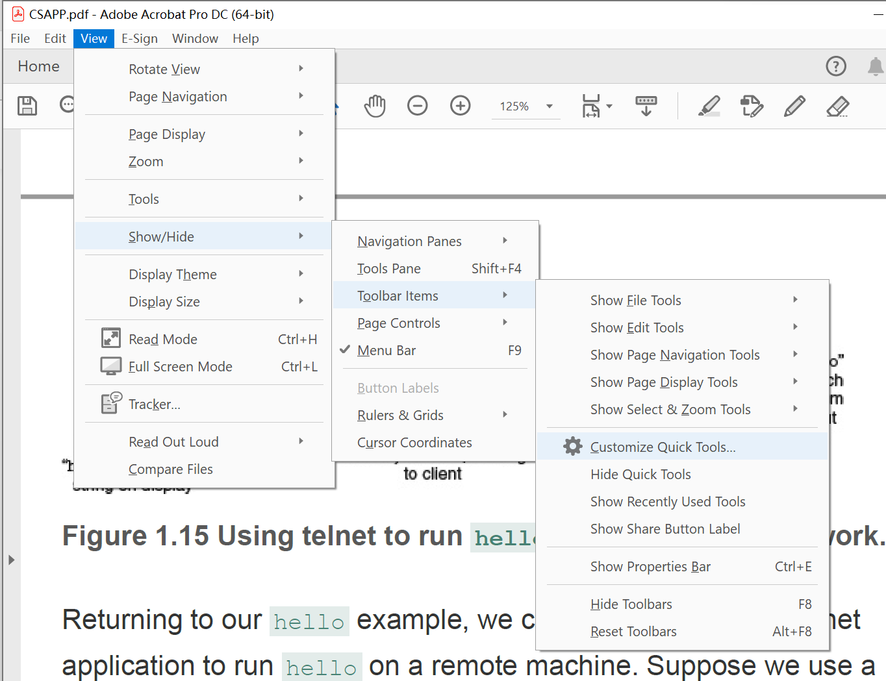

# Windows

## 环境变量

path是Windows查找.exe文件的路径；classpath是jvm查找.class文件的路径 

CLASSPATH

系统变量Java_home

#### 配完环境.jar文件仍打不开

注册表改为

## think book16+

开机F1进BIOS

电池阈值（把电脑管家删了），无解

## 代理

## 网上下pdf文件

如果页面下载建下得很慢，就先用edge打开pdf，再点里面的下载

## Acrobat

edit->preference

工具栏

## 重装后

### VirtualBox

重装了

### QQ

点exe没反应

重装了

## 