# 2023

## 5/6

### Training-WWW-Robots

  网站的根目录下有个robots.txt，可查看哪些爬虫被允许访问哪些内容

 [robots.txt - Wikipedia](https://en.wikipedia.org/wiki/Robots.txt) 

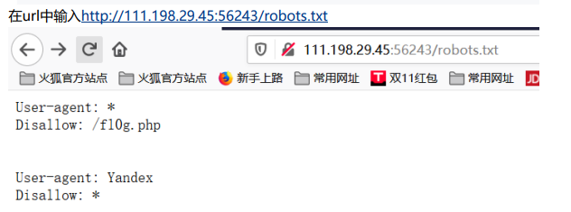

  到这里以后，我先访问了f10g.php，得到一个cyberpeace，我以为这是被加密了，必须要用Yandex进行访问，于是开始抓包改包。改包发现自己不会改数据包里的user agent，于是用命令行的curl -A ‘agent’ [url]，得到了一样的结果。没办法，看writeup，发现这就是flag……好吧，结束。

### PHP2

就给了一句 Can you anthenticate to this website？，啥也没有。

开始找php的目录，死活找不到，好像有工具可以扫。

先是用了index.php，啥也没有，看了writeup才知道有个index.phps可以在网页看源代码，于是得到代码如下

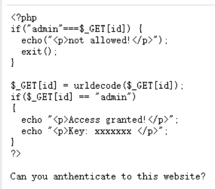

不懂php，只看自己认识的，然后大概知道好像是要解码

查了之后发现是在给网站赋值id

格式：/?id=xxxxxx。一次加密会被浏览器自动解密为admin，not allowed，于是加密两次

### unserialize3

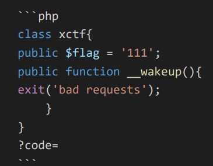

给了一段php的代码，只知道应该是要给code赋一个值，然后就没头绪了。

查了后知道是反序列。

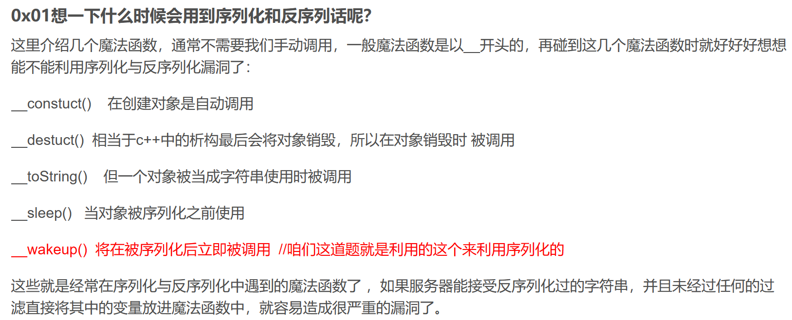

序列化通俗来讲就是将对象转化为可以传输的字符串；

反序列化就是把那串可以传输的字符串再变回对象。 

***\*__wakeup()执行漏洞：一个字符串或对象被序列化后，如果其属性被修改，则不会执行__wakeup()函数，这也是一个绕过点。\**** 

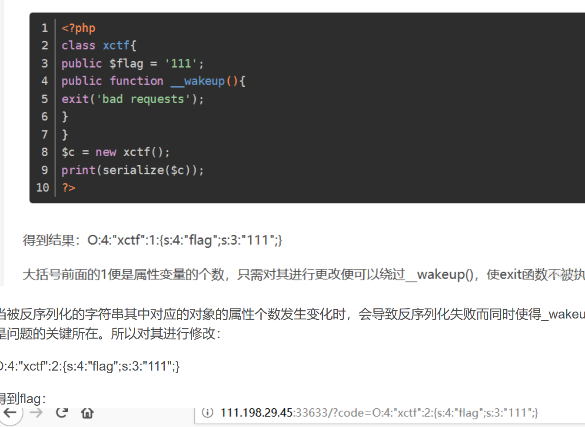

感觉这种题要系统地学PHP才知道……

## 5/10

### disabled_button

改网页上的内容最好在元素那里找，很方便

### get_post

用get提供参数

法一 直接改URL：

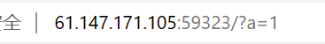

法二 burp suite

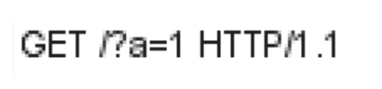

用post提供参数

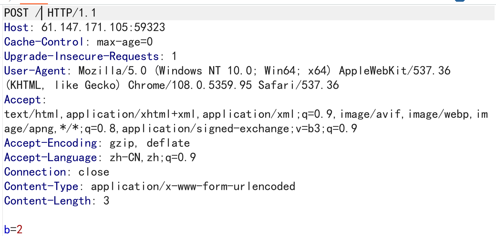

这样不行……因为必须从a=1那一问过去b=2，所以必须这样

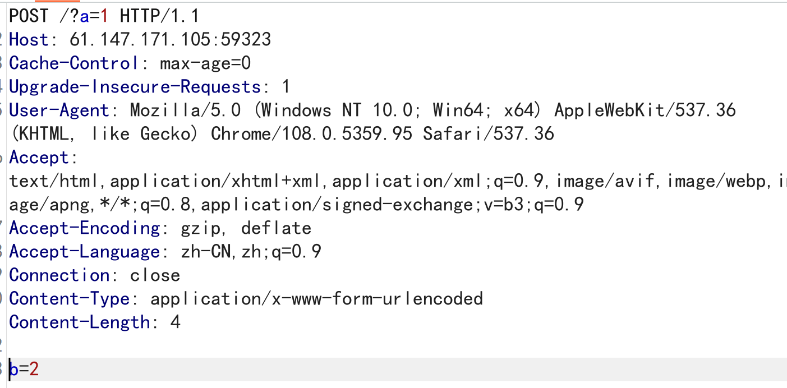

post与get的区别难道是因为body的位置不同，所以不能在上面写b吗

### weak_auth

这题，进去admin，然后随手打了个123456，过了……尊重一下还在扫描的御剑好不好

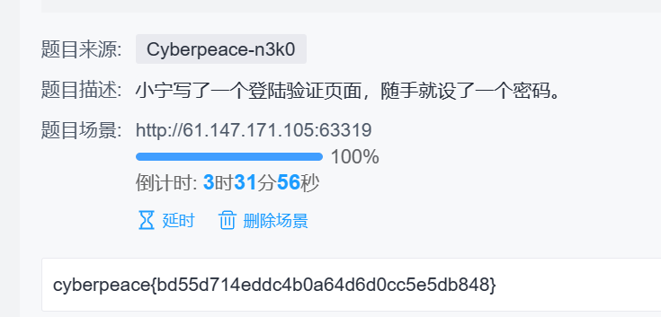

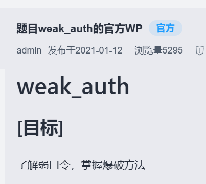

正解，用burp suite爆破。御剑扫不出东西。

加载密码库

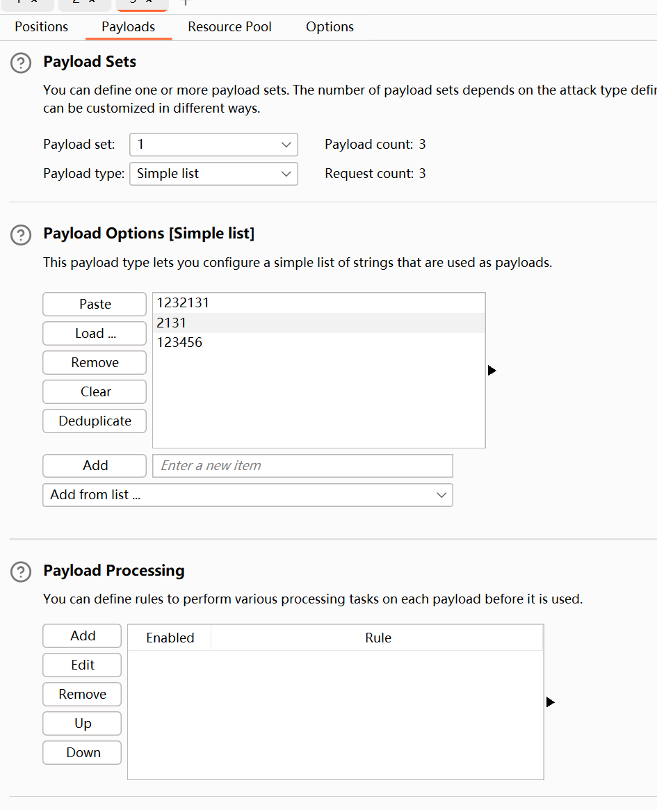

今天梯子挂了，没登上GitHub，自己随便编了几个

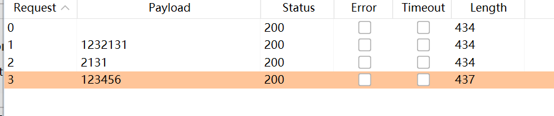

### simple_php

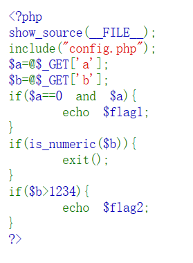

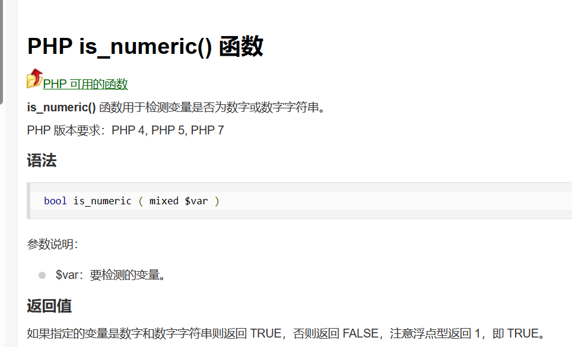

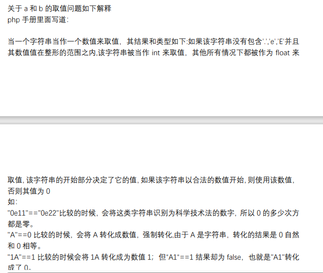

## 5/12

### command_execution

#### waf

Web应用防火墙

可以防止Web应用免受各种常见攻击，比如SQL注入，跨站脚本漏洞（XSS）等。WAF也能够监测并过滤掉某些可能让应用遭受DOS（拒绝服务）攻击的流量。WAF会在HTTP流量抵达应用服务器之前检测可疑访问，同时，它们也能防止从Web应用获取某些未经授权的数据。 

#### 命令执行漏洞

应用有时需要调用一些执行系统命令的函数，如PHP中的system、exec、shell_exec、passthru、popen、proc_popen等，当用户能控制这些函数的参数，并且开发人员对这个参数没有严格的过滤时就可以将恶意系统命令**拼接**到正常命令中，从而造成命令执行攻击，这就是命令执行漏洞。

#### ping

通过发送 Internet 控制消息协议 (ICMP) 回显请求消息，验证与另一台 TCP/IP 计算机的 IP 级别连接情况。 会显示接收到的相应回显回复消息和往返时间。 ping 是用于排查连接性、可访问性和名称解析问题的主要 TCP/IP 命令。 如果在没有参数的情况下使用，此命令会显示帮助内容。

还可以使用此命令来测试计算机名称和计算机的 IP 地址。 如果针对 IP 地址的 ping 操作成功，但针对计算机名称的 ping 操作失败，则可能是名称解析问题。 在这种情况下，请确保可通过本地主机文件、域名系统 (DNS) 查询或 NetBIOS 名称解析技术来解析你指定的计算机名称。

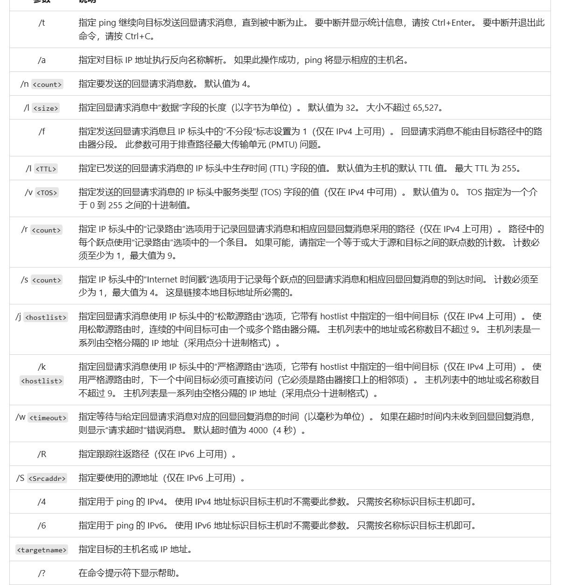

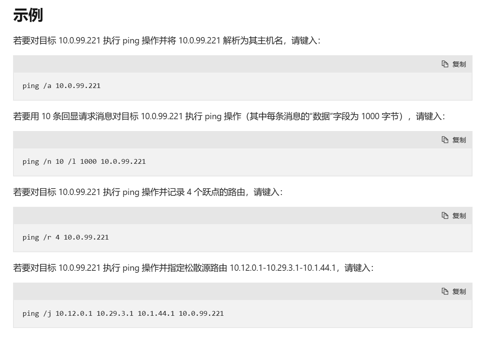

尝试/a

开始无法返回主机名，更改host文件后解决

host文件位置："C:\Windows\SysWOW64\WindowsPowerShell\v1.0\Modules\Microsoft.PowerShell.Host\Microsoft.PowerShell.Host.psd1"

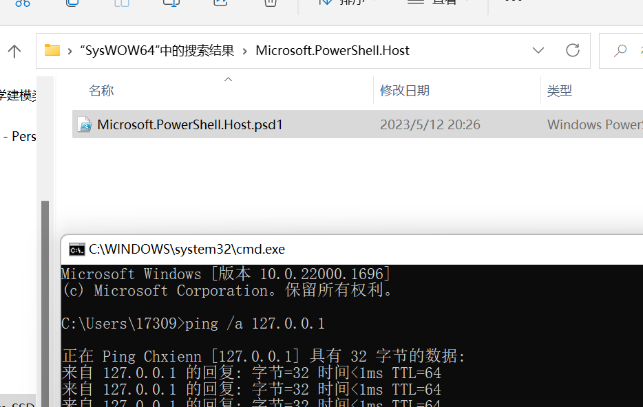

不知道这个原理是什么，但肯定不是DNS

因为经尝试不行（不是语法问题，各种排列组合都试过了，应该是在别的文件更改）

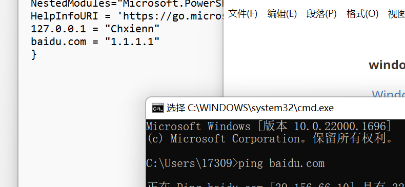

"C:\Windows\System32\drivers\etc\hosts"

"C:\Windows\WinSxS\amd64_microsoft-windows-w..ucture-other-minwin_31bf3856ad364e35_10.0.22000.1_none_8b833b1c69db05a2\hosts"

这两文件一模一样

感觉第一个是永久的

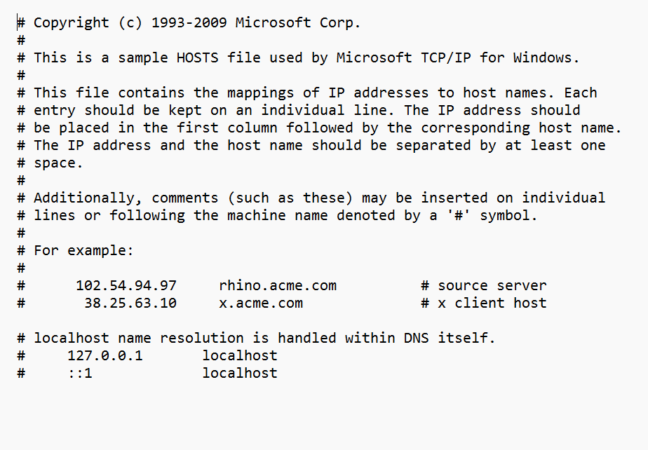

#### ls

查看目录

#### cat

将文件内容输出到命令行中

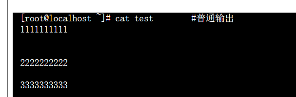

## 5/13

### xff_referer

 伪造X-Forwarded-for 和referer

注意，当加东西到末尾后面要**加两个回车**，这是格式。格式不对没有response

#### X-Forwarded-For: IP

X-Forwarded-For(XFF) 简称XFF头，它代表客户端，也就是HTTP的请求端真实的IP，只有在通过了HTTP 代理或者负载均衡服务器时才会添加该项。 

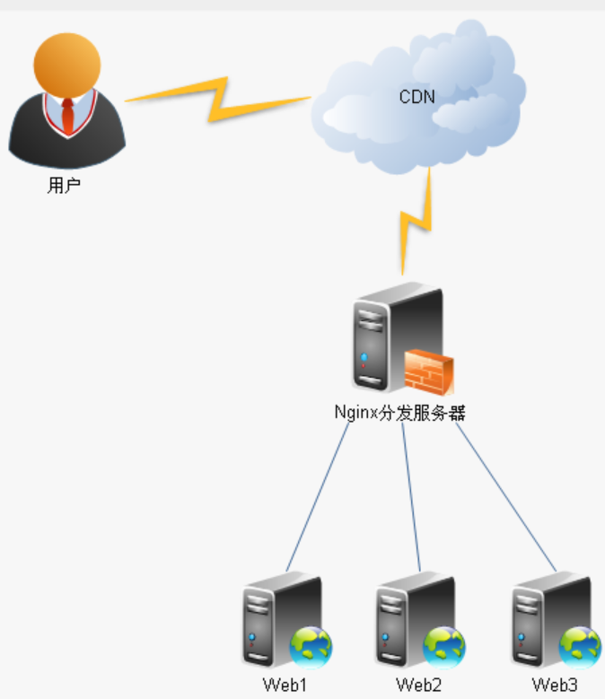

我的理解是通过xff可以知道用户IP地址，从而给用户分配最近的服务器

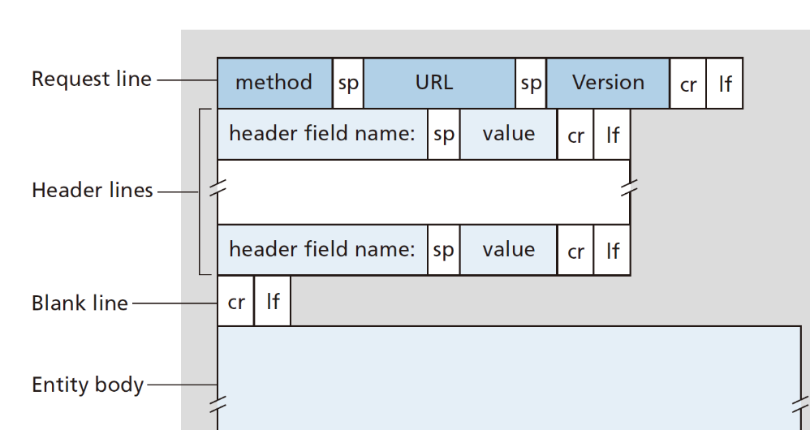

#### referer：来源（从哪里来这个页面的）

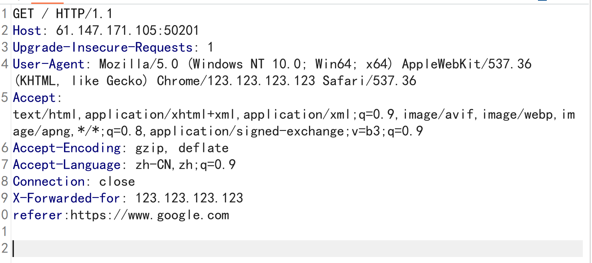

## 5/14

### simple_js

F12，给了段js的代码，读完后发现与输入值无关。所以这题就是就是代码写错了，所以怎么输入都是密码错误。把代码改正确，并保存为html，再把代码中的密码转换为正确格式输入即可得到flag。

##### \x的编码

可以把\x手动 转化为%再用URL解码

## 5/20

### baby_web

点进去自动1.php

把1.php删掉访问前面，得到Flag

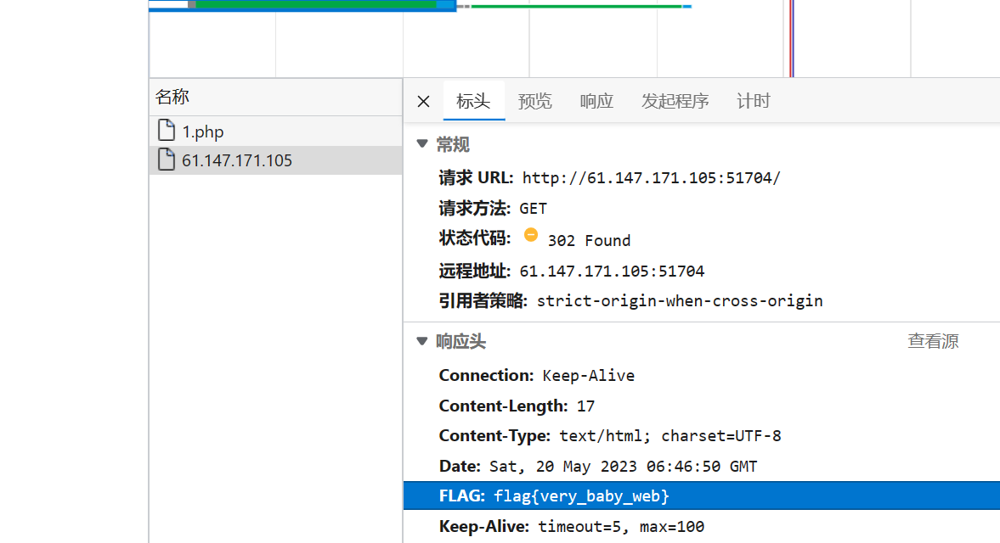

### ics-06

思路完全跑偏了。他是里面有个不一样的网页，然后发现id是爆破点。我……F12看到里面有个红色的链接，并可以下载一个txt，里面是processGoogleToken，然后我chatgpt发现这是sever端的东西，肯定不是，于是看writeup。

## 5/23

### php_rce

RCE漏洞，可以让攻击者直接向后台服务器远程注入操作系统命令或者代码，从而控制后台系统 