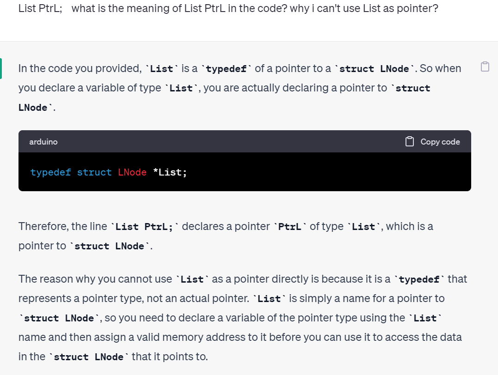
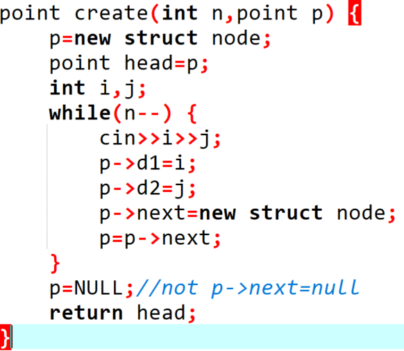
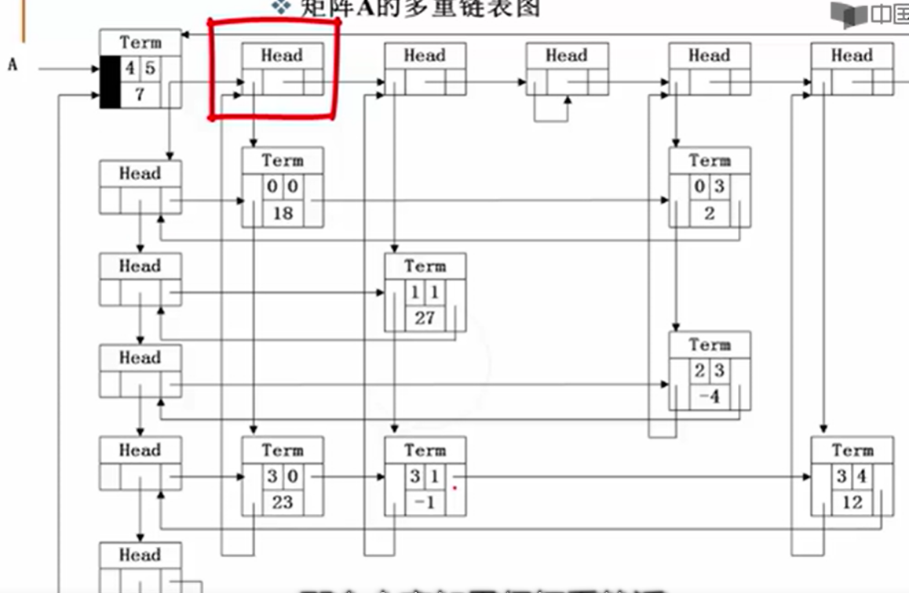
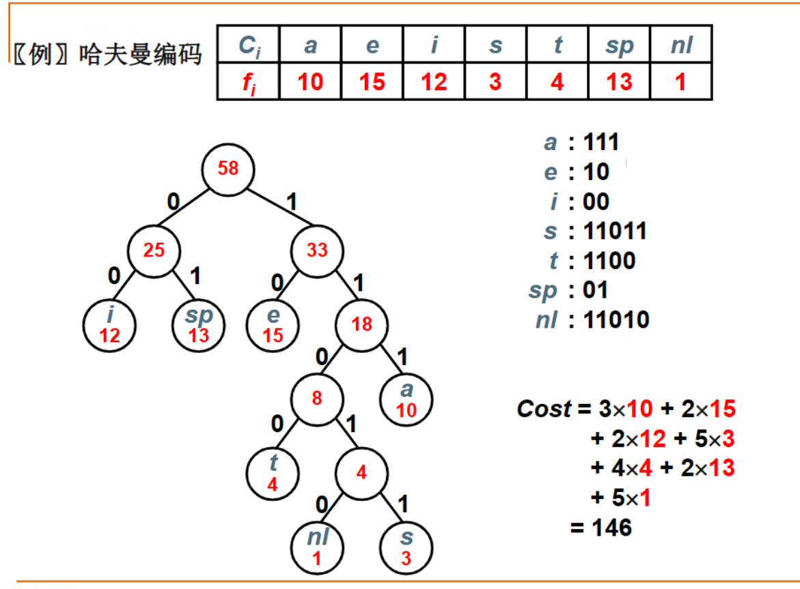
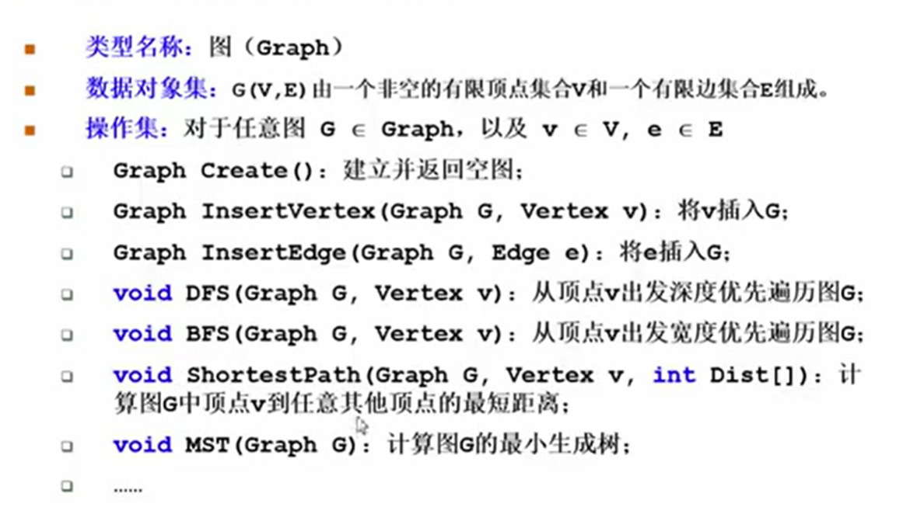

# 数据结构

## 线性结构


### 线性表

抽象数据类型描述：

类型名称

数据对象集

操作集：初始化，根据位序返回元素，查找第一次出现的位置，插入，删除，返回长度

#### 顺序=>数组 

```
typedef struct LNode *List;//List is a type
struct LNode{
	ElementType Data[MAXSIZE];
	int Last;
};//为什么要用struct=>我想让它最终呈现一个封装的形式，能够通过一个接口去访问所有我想要的东西，而不是还需要我自己去求它的长度
struct LNode L;
List PtrL;
//访问下标为i的元素：L.Data[i]||PtrL->Data[i]
//表的长度为PtrL->Last+1||L.Last+1(加不加一看最初Last值)
```




##### 初始化

```
List MakeEmpty()
{
	List PtrL;
	PtrL=(List)malloc(sizeof(struct LNode));
	PtrL->Last=-1;
	return PtrL;
}
```

##### 查找

```
int Find(ElementType X, List PtrL)
{
	int i=0;
	while(i<=PtrL->Last&&PtrL->Data[i]!=X) i++;
	if(i>PtrL->Last) return -1;//didn't find
	else return i;
}
```

##### 插入

```
void Insert(ElementType X,int i,List PtrL){
	if(PtrL->Last==MAXSIZE-1){
		return;//表满
	}
	if(i<1||i>PtrL->Last+2){//要插在表中
		return;//invalid
	}
	for(int j=PtrL->Last;j>=i-1;j--){//for(int j=Last;是不对的！！
		PtrL->Data[j+1]=PtrL->Data[j];
	}
	PtrL->Last++;//移动完后Last值也改变
	PtrL->Data[i-1]=X;
    return；
}
```

##### 删除

```
void Delete(int i,List PtrL){
	if(i<1||i>List->Last+1) return;//invalid（Last从0开始算）
//	if(List->Last==0) return; i<1就是空表
	for(int j=i-1;j<Last;j++){
		List->Data[j]=List->Data[j+1];
	}
	List->Last--;
	return;
}
```


#### 链式=>链表


```
typedef struct LNode *List;
struct LNode{
	ElementType Data;
	List Next;
};
struct Lnode L;
List PtrL;
```

##### 求表长

```
int Length(List PtrL){
    List p=PtrL->Next; //不要改头结点位置
	int cnt=0;
	while(p){
		cnt++;
		p=p->Next;
	}
	return cnt;
}
```

##### 查找

按序号查找

```
List FindKth(int K,List PtrL)
{
	List p=PtrL->Next;
	int i=1;
	while(p!=NULL&&i<K){
		p=p->Next;
		i++;
	}
	if(i==K)return p;
	else return NULL;
}
```

按值查找

```
List Find(ElementType X,List PtrL)
{
	List p=PtrL->Next;
	while(p!=NULL&&p->Data!=X)
	p=p->Next;
	return p;//更简洁
//	while(p!=NULL){
//		if(p->Data==X) return p;
//		else p=p->Next;
//	}
//	return p;
}
```

##### 插入

```
List Insert(ElementType X,int i,List PtrL)
{
	List p,s;
	if(i==1){
		s=(List)malloc(sizeof(struct LNode));
		s->Data=X;
		s->Next=PtrL;
		return s;//不是dummy node！这里的s已经是第一个结点
	}
	p=FindKth(i-1,PtrL);
	if(p==NULL)return NULL;//element wrong
	else{
		s=(List)malloc(sizeof(struct LNode));
		s->Data=X;
		s->Next=p->Next;
		p->Next=s;
		return PtrL;//返回头结点（仍为dummy node）ps:已经是新链表了）
	}
}
```

##### 删除

```
List Delete(int i,List PtrL){
	  List p=FindKth(i-1,PtrL);
	  if(p==NULL) return NULL;
    List s=FindKth(i,PtrL);
	  if(s==NULL) return NULL;
    p->Next=s->Next;
    free(s);
    return PtrL;
    List p,s;
    if(PtrL==NULL) return NULL;
    if(i==1){
    	s=PtrL->Next;
        PtrL->Next=s->Next;
    	free(s);
    	return PtrL;
    }
    p=FindKth(i-1,PtrL);
    if(p==NULL) return NULL;
    else if(p->Next==NULL) return NULL;
    else{
    	s=p->Next;
    	p->NEXT=s->Next;
    	free(s);
    	return PtrL;
    }
}
```

##### 应用实例教训：



这样建，出来的是这样


然后再指向NULL

可以加个if去掉那个random。


### 广义表，多重链表

转化为线性表

线性表：n个元素都是基本的单元素

广义表：元素可以是另一个广义表


多重链表：链表中的结点可能隶属于多个链，指针域会有多个（但包含两个指针域的链表不一定是多重链表，比如双向链表不是多重链表）

树，图都可以采用多重链表的方式实现存储

##### 矩阵

二维数组表示缺陷：数组大小需事先确定，对于稀疏矩阵会造成存储空间浪费。

十字链表：行，列，值



head既作为行的头结点也作为列的头结点

### 堆栈

有优先级（表达式求值）

后入先出

#### 操作

##### 数组

```
#define MaxSize
typedef struct SNode *Stack;
struct SNode{
	ElementType Data[MaxSize];
	int Top;
}
//入栈
void Push(Stack PtrS,ElementType item)
{
	if(PtrS->Top==MaxSize-1) return;//PtrS->Top==MaxSize-1？？？？
	//=>++(PtrS->Top)==Maxsize  when PtrS->Top==MaxSize-1
	
	else {
		PtrS->Data[++(PtrS->Top)]=item;
		return;
	}
}
//出栈
ElementType Pop(Stack PtrS,ElementType item)
{
	if(PtrS->Top==-1)return ERROR;//空
	else{
		return(PtrS->Data[(PtrS->Top)--];	
	}
}
```


```
#define MaxSize
struct DStack{
	ElementType Data[MaxSize];
	int Top1;
	int Top2;
};
void Push(struct DStack *PtrS,ElementType item,int Tag)
{
	if(PtrS->Top2-PtrS->top1==1) return;//堆栈满
	if(Tag==1) PtrS->Data[++(PtrS->Top1)]=item;
	else PtrS->Data[--(PtrS->Top)]=item;
}
ElementType Pop(struct DStack *PtrS,int Tag){
	if(Tag==1){
		if(PtrS->Top2==-1) return NULL;
		else return PtrS->Data[(PtrS->Top2)--];
	} else{
		if(PtrS->Top2==MaxSize) return NULL;
		else return PtrS->Data[(PtrS->Top2)++];
	}
}
```

##### 链表

栈顶指针应该在链表表头（表尾可入栈，但出栈很麻烦，因为又要去找上个结点）

```
typedef struct SNode *Stack;
struct SNode{
	ElementType Data;
	struct SNode *Next;
};
//构建一个头结点，便于插入和删除
Stack CreateStack(){
	Stack S;
	S=(Stack)malloc(sizeof(struct SNode));
	S->Next=NULL;
	return S;
}
//判断是否空
int IdEmpty(Stack S){
	return (S->Next==NULL);//空返回1，非空返回0
}
//入
void Push(ElementType item,Stack S){
	struct SNode *TmpCell;
	TmpCell=(Stack SNode *)malloc(sizeof(struct SNode));
	TmpCell->Element=item;
	TmpCell->Next=S->Next;
	S->Next=TmpCell;
}
//出
ElementType Pop(Stack S){
	struct SNode *FirstCell;
	ElementType TopElem;
	if(IsEmpty(S)) return NULL;
	else{
		FirstCell =S->Next;
		S->Next=FirstCell->Next;
		TopElem=FirstCell->Element;
		free(FirstCell);
		return TopElem;
	}
}
```

#### 应用：

表达式求值


```

```

函数调用几递归实现

深度优先搜索

回溯算法

### 队列


一端插入，另一端删除

先来先出

##### 数组

```
#define MaxSize
struct QNode{
	ElementType Data[MaxSize];
	int rear;
	int front;
};
typedef struct QNode *Queue;

```

循环队列


队列状态有n+1种，Front和Rear相差情况有n种=>无法用差值表示所有情况

解决方案：

1.使用额外标记

2.仅使用n-1个数组空间

```
//入
void AddQ(Queue PtrQ,ElementType item)
{
	if((PtrQ->rear+1)%MaxSize==PtrQ->front){
		return;//满
	}
	PtrQ->rear=(PtrQ->rear+1)%MaxSize;//实现由尾到头
	PtrQ->Data[PtrQ->rear]=item;
}
//出
ElementType DeleteQ(Queue PtrQ){
	if(PtrQ->front==PtrQ->rear){
		return ERROR;//空
	}else{
		PtrQ->front=(PtrQ->front+1)%MaxSize;//最开始为-1
		return PtrQ->Data[PtrQ->front];
	}
}
```

##### 链表


```
struct Node{
	ElementType Data;
	struct Node *Next;
};
struct QNode{
	struct Node *rear;
	struct Node *front;
};
typedef struct QNode *Queue;
//入队
void AddQ(ElementType item,Queue PtrQ)
{
	struct Node *RearCell;
	RearCell=(struct Node *)malloc(sizeof(struct Node));
	RearCell->Data=item;
	RearCell->Next=NULL;
	if(PtrQ->rear==NULL){//空
		PtrQ->front=RearCell;
		PtrQ->rear=RearCell;
	}
	else{
		PtrQ->rear->Next = RearCell;//改变结点指向
		PteQ->rear=RearCell;//改变队尾指向
	}
}
//出队
ElementType DeleteQ(Queue PtrQ)
{
	struct Node *FrontCell;
	ElementType FrontElem;
	if(PtrQ->front==NULL){
		return ERROR;
	}
	FrontCell=PtrQ->front;
	FrontElem=FrontCell->Data;
	if(PtrQ->front==PtrQ->rear)//只有一个元素
		PtrQ->front=PtrQ->rear=NULL;
	else
		PtrQ->front=PtrQ->front->Next;	
	free(FrontCell);
	return FrontElem;
}
```


## 树

### 二叉树

完全二叉树


完美二叉树


树叶数=度为2的非叶结点数+1

#### 存储

数组=>空间浪费

链表=>左儿子右兄弟

结构数组=>静态链表


找根：没有被指向

#### 遍历=>二维变一维

##### 二叉树三种遍历的规律

如果其中序遍历结果与前序遍历结果一样， 该二叉树没有左儿子，与前序遍历结果相反，没有右儿子

如果其中序遍历结果与后序遍历结果一样，该二叉树没有右儿子；与后序遍历结果相反，没有左儿子。

在前序遍历中，跟在父节点后出现的第一个结点一定是左儿子，左儿子输出完的第一个结点是右儿子

**对于前（后）序遍历和中序遍历确定二叉树**：

前（后）序遍历确定根，中序遍历确定左右儿子

##### 前序：结左右(第一次碰到结点时输出)

```c++
void search(BinTree BT){
    BinTree T=BT;
    Stack S=CreatStack(MaxSize);
    while(T||!IsEmpty(S)){
        while(T){
            push(S,T); 
            printf("%d",T->Data);
        	T=T->left;  
        }
    	if(s!=NULL){
        	T=pop(S,T);
        	T=T->right;
    	}
    }
}
```

##### 中序：左结右（第二次碰到结点时输出）

```c++
void search(BinTree BT){
    BinTree T=BT;
    Stack S=CreatStack(MaxSize);
    while(T||!IsEmpty(S)){
        while(T){
            push(S,T);   
        	T=T->left;  
        }
    	if(s!=NULL){
        	T=pop(S,T);
        	printf("%d",T->Data);
        	T=T->right;
    	}
    }
}
```

##### 后序：左右结（第三次碰到结点）

```c++
//strcut TreeNode {
//  ElemType data;
//  TreeNode *left, *right;
//  TreeNode() {
//      left = right = NULL;
//  }
//}
void PostOrder(TreeNode BT) {
    TreeNode T= BT, r = NULL;
    Stack S=CreatStack(MaxSize);
    while (T || !S.empty()) {
        if (T) {//走到最左边
            push(S,T);
            T = T->left;
        }
        else {
            T = pop(S,T);
            if (T->right && T->right != r)//右子树存在，未被访问
                T = T->right;
            else {
                pop(S,T);
                printf("%d",T->Data);
                r = T;//记录最近访问过的节点
                T = NULL;
                //节点访问完后，重置p指针,必须重置，因为左右都访问完了，需pop
            }
        }//else
    }//while
}
```

这三种都可以使用堆栈

层序遍历=>队列保存

```c++
void LevelOrderTraversal(BinTree Bt){
    Queue Q; BinTree T;
    if(!BT) return;
    Q=CreatQueue(MaxSize);
    AddQ(Q,BT);
    while(!IsEmptyQ(Q)){
        T=DeleteQ(Q);
        printf("%d\n",T->Data);
        if(T->Left)AddQ(Q,T->Left);
        if(T->Right)AddQ(Q,T->Right);
    }
}
```

#### 应用

##### 输出叶子节点

判断无左右儿子

```C
void PostOrderPrintLeaves(BinTree BT){
    if(BT){
        if(!BT->Left&&!BT->Right) printf("%d",BT->Data);
        PostOrderPrintLeaves(BT->Left);
        PostOrderPrintLeaves(BT->Right);
    }
}
```


##### 求二叉树高度

左右子树高度+1

```c++
int PostOrderGetHeight(BinTree BT)
{
    int HL,HR,MaxH;
    if(BT){
        HL=postOrderGetHeight(BT->Left);
        HR=postOrderGetHeight(BT->Right);
        MaxH=(HL>HR)?HL:HR;   
        return (MaxH+1);
    }
    else return 0;
}
```

##### 二元运算表达式树及其遍历


可以通过加括号的方式准确实现中缀表达式

#####  两种遍历序列确定二叉树

必须有中序遍历（先+中/后+中）


##### 判断相等

```
int check(Tree root1,Tree root2) {
	if(root1==NULL&&root2==NULL){
		return 1;
	}
	if(root1->data==root2->data) {
		return check(root1->left,root2->left)&&check(root1->right,root2->right);
	} else return 0;
}
//一定是两边一起=>&&
```


##### 判断同构

左右孩子交换可变成一样

```
int judge(int r1,int r2) {
	//cout<<r1<<" "<<r2<<endl;
	//printf("t1[r1].a:%d t2[r2].a:%d t1[r1].l:%d t1[r1].r:%d t2[r2].l:%d t2[r2].r:%d\n",	t1[r1].a,t2[r2].a,t1[r1].l,t1[r1].r,t2[r2].l,t2[r2].r);
	if(n[0]==n[1]&&n[0]==0) return 1;
//	if(n[0]!=n[1]) return 0;
    if(t1[r1].a!=t2[r2].a) return 0;
	else if(t1[r1].l=='-'-'0'&&t1[r1].r=='-'-'0'&&t2[r2].l=='-'-'0'&&t2[r2].r=='-'-'0') 		return 1;
	else if(t1[r1].l!='-'-'0'&&t2[r2].l!='-'-'0'&&t1[r1].r=='-'-'0'&&t2[r2].r=='-'-'0') 		return (judge(t1[r1].l,t2[r2].l));
	else if(t1[r1].l!='-'-'0'&&t2[r2].r!='-'-'0'&&t1[r1].r=='-'-'0'&&t2[r2].l=='-'-'0') 		return (judge(t1[r1].l,t2[r2].r));
	else if(t1[r1].r!='-'-'0'&&t2[r2].l!='-'-'0'&&t1[r1].l=='-'-'0'&&t2[r2].r=='-'-'0') 		return (judge(t1[r1].r,t2[r2].l));
	else if(t1[r1].r!='-'-'0'&&t2[r2].l!='-'-'0'&&t1[r1].r=='-'-'0'&&t2[r2].l=='-'-'0') 		return (judge(t1[r1].r,t2[r2].l));
	else if(t1[r1].l!='-'-'0'&&t2[r2].l!='-'-'0' &&t1[r1].r!='-'-'0'&&t2[r2].r!='-'-'0') 
		return (judge(t1[r1].l,t2[r2].l)&&judge(t1[r1].r,t2[r2].r)
	       		||judge(t1[r1].l,t2[r2].r)&&judge(t1[r1].r,t2[r2].l));
	else return 0;
}
```


### 二叉搜索树

把数据放到树上进行查找


```
Position IterFind(ElementType X,BinTree BST)
{
	while(BST){
		if(x>BST->Data)
			BST=BST->Right;
		else if(BST<BST->Data)
			BST=BST->Left;
		else
		 return BST;
	}
	return NULL:
}
```

##### 查找最大最小：最大一定在最右(叶或根)，最小一定在最左（叶）


###### 感觉不全对啊，如果是这样子的呢


这个不是二叉搜索树，二叉搜索树是子树的所有键值，不是单单是两个儿子的键值

##### 插入

与输入顺序有关（比如12与21，先1后2就是1为结点2为右儿子，先2后1就是2为结点1为左儿子）

```
BinTree Insert(ElementType X,BinTree BTS)
{
	if(BTS==NULL){
		BST=new TreeNode;
		BTS->Data=X;
		BST->Left=BST->Right=NULL;
	} else{
		if(X>BTS->Data){
			BTS->Right=Insert(X,BTS->Right);//以此来保留上一级路径
		}
		else if(X<BTS->Data){
			BTS->Left=Insert(X,BTS->Left);
		}
	}
	return BST;//最终返回头结点
}
```

##### 删除

要删除的结点有两个子树

左儿子最大值/右儿子最小值当被删的节点（copy过去）


```
BinTree Delete(ElementType X,BinTree BST)
{
	if(X>BST->Data){
		BST->Right=Delete(X,BST->Right);
	}
	if(x<BST->Data){
		BTS->Left=Insert(X,BTS->Left);
	}
	if(X==BST->Data){
		if(BST->Left&&BST->Right){
			Tmp=FindMin(BST->Right);//右子树中找最小值
			BST->Data=Tmp->Data;
			BST->Right=Delete(BST->Data,BST->Right);
		}
		else{
			Position Tmp=BST;
			if(!BST->Left) BST=BST->Right;
			else if(!BST->Right) BST=BST->Left;
			free(Tmp);
		}	
	}
	return BST;
}
```

### 平衡二叉树

对于搜索树不同插入顺序造成树的深度不同，导致效率不同


##### 平衡二叉树的调整

右子树的右边


左子树的左边


左子树的右边


右子树的左边


```
typedef struct AVLNode *Position;
typedef Position AVLTree; /* AVL树类型 */
struct AVLNode{
    ElementType Data; /* 结点数据 */
    AVLTree Left;     /* 指向左子树 */
    AVLTree Right;    /* 指向右子树 */
    int Height;       /* 树高 */
};

int Max ( int a, int b )
{
    return a > b ? a : b;
}

AVLTree SingleLeftRotation ( AVLTree A )
{ /* 注意：A必须有一个左子结点B */
  /* 将A与B做左单旋，更新A与B的高度，返回新的根结点B */     

    AVLTree B = A->Left;
    A->Left = B->Right;//把A->left指向A即将到达的位置B，与下一句顺序可换
    B->Right = A;
    A->Height = Max( GetHeight(A->Left), GetHeight(A->Right) ) + 1;
    B->Height = Max( GetHeight(B->Left), A->Height ) + 1;
 
    return B;
}

AVLTree DoubleLeftRightRotation ( AVLTree A )
{ /* 注意：A必须有一个左子结点B，且B必须有一个右子结点C */
  /* 将A、B与C做两次单旋，返回新的根结点C */
    
    /* 将B与C做右单旋，C被返回 */
    A->Left = SingleRightRotation(A->Left);
    /* 将A与C做左单旋，C被返回 */
    return SingleLeftRotation(A);
}

/*************************************/
/* 对称的右单旋与右-左双旋请自己实现 */
/*************************************/

AVLTree Insert( AVLTree T, ElementType X )
{ /* 将X插入AVL树T中，并且返回调整后的AVL树 */
    if ( !T ) { /* 若插入空树，则新建包含一个结点的树 */
        T = (AVLTree)malloc(sizeof(struct AVLNode));
        T->Data = X;
        T->Height = 0;
        T->Left = T->Right = NULL;
    } /* if (插入空树) 结束 */

    else if ( X < T->Data ) {
        /* 插入T的左子树 */
        T->Left = Insert( T->Left, X);
        /* 如果需要左旋 */
        if ( GetHeight(T->Left)-GetHeight(T->Right) == 2 )
            if ( X < T->Left->Data ) 
               T = SingleLeftRotation(T);      /* 左单旋 */
            else 
               T = DoubleLeftRightRotation(T); /* 左-右双旋 */
    } /* else if (插入左子树) 结束 */
    
    else if ( X > T->Data ) {
        /* 插入T的右子树 */
        T->Right = Insert( T->Right, X );
        /* 如果需要右旋 */
        if ( GetHeight(T->Left)-GetHeight(T->Right) == -2 )
            if ( X > T->Right->Data ) 
               T = SingleRightRotation(T);     /* 右单旋 */
            else 
               T = DoubleRightLeftRotation(T); /* 右-左双旋 */
    } /* else if (插入右子树) 结束 */

    /* else X == T->Data，无须插入 */

    /* 别忘了更新树高 */
    T->Height = Max( GetHeight(T->Left), GetHeight(T->Right) ) + 1;
    
    return T;
}
```


### 堆

解决需要考虑优先级别的问题=>优先队列


从下标为1的地方开始存储

##### 插入


##### 删除


##### 建立


### 哈夫曼树和哈夫曼编码


##### 构造

把权值最小的二叉树合并

利用堆（最小堆）


#### 哈夫曼编码

避免二义性=>出现在叶节点上




### 集合

##### 表示


 


##### 查找


##### 并运算


## 图




