? means guess.

???means i don't understand

#  Chapter 1 A Tour of Computer Systems

### 1.1 Information Is Bits + Context

### 1.2 Programs Are Translated by Other Programs into Different Forms

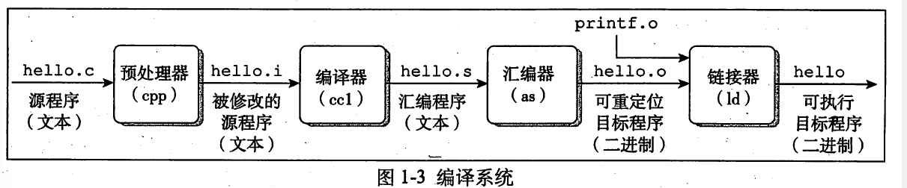

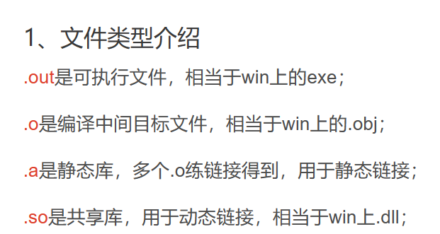

### Preprocessing  phase

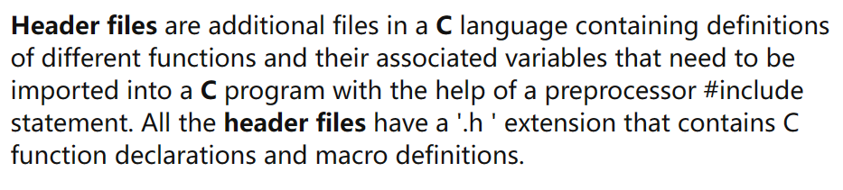

modify the original C program according to directives that begin with the # character(insert it directly into the program)

### Compilation phase

translates the text file hello.i into the text file hello.s ,which contains an assembly-language program. 

Assembly language is useful because it provides a common output language for different compilers for different high-level languages.

### Assembly phase

###### ?what is object file? the program has been change into binary

 [Chapter 4: Object Files (linuxbase.org)](https://refspecs.linuxbase.org/elf/gabi4+/ch4.intro.html) 

at this context, a *relocatable file* holds code and data suitable for linking with other object files to create an executable or a shared object file.

######  ?this phase only generate one file?

### 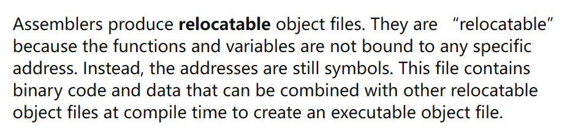

### Linking phase

###### ?preprocessing phase read the contents of head files, inserting the functions of head files in origin program. These functions have already generated object file. This phase is to merge origin object file with functions object file that are called. 

I search iostream in my DEV C++, and it is 

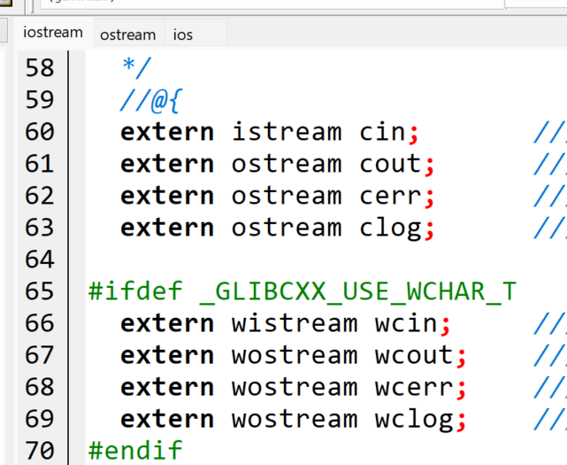

then i open ostream

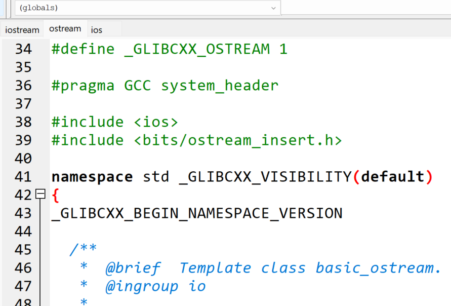

its following is a class. 

###### ?the insertion is to insert the Function Prototype. And the function body was merged in linking phase.

###### ?when these functions to be object flies. 

they were saved in specific folders

###### ?i didn't find .o files on ostream?

maybe it was merged with other flies

###### ?why don't insert the whole function into origin program?

i think a head file may contains lots of function. if insert all functions into origin function, it will waste time and space.

###### why there is no bits/ostream_insert.h file while it can still be #

bits is a folder

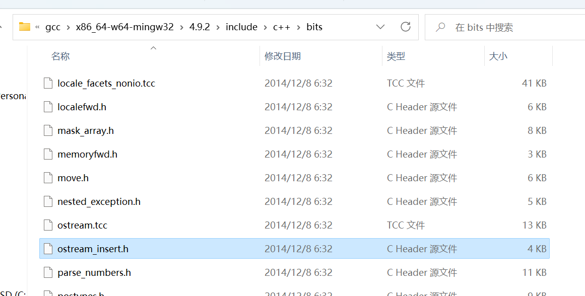

### 1.3 It Pays to Understand How Compilation Systems Work

### 1.4 Processors Read and Interpret Instructions Stored in Memory

#### 1.4.1 Hardware Organization of a System

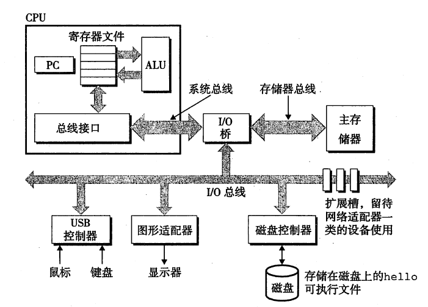

##### Buses

##### I/O Devices

##### Main Memory

##### Processor

###### ?which component executes the instruction pointer at by PC

###### ?what the use of register file 

store the data

The register file is a small amount of fast memory that is used to store the most frequently accessed data. 

#### 1.4.2 Running the hello Program

disk->main memory->register file->display 

### 1.5 Caches Matter

the duration of execute lead to read, search need more time

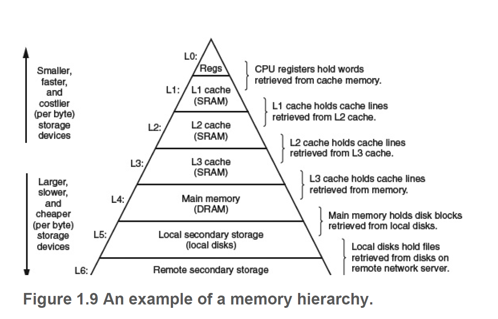

###### where is cache

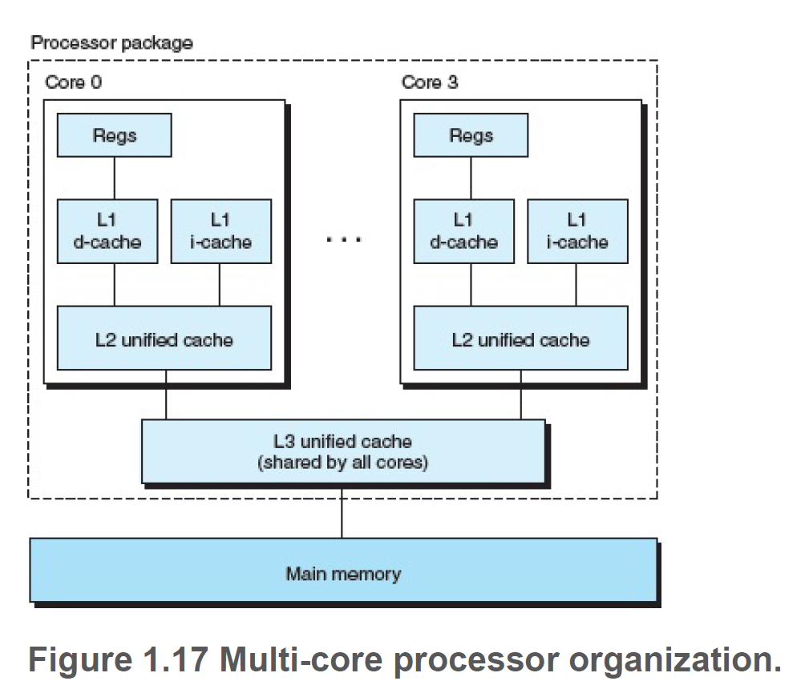

### 1.6 Storage Devices Form a Hierarchy

### 1.7 The Operating System Manages the Hardware

#### 1.7.1 Processes

###### ?what the relationship between the kernel of operating system and CPU? kernel manage the processes and send them to CPU？

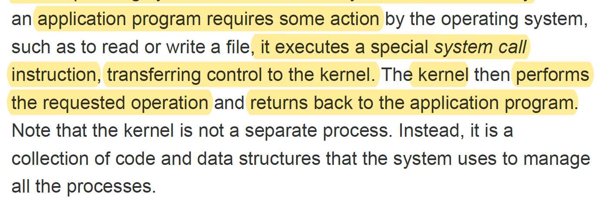

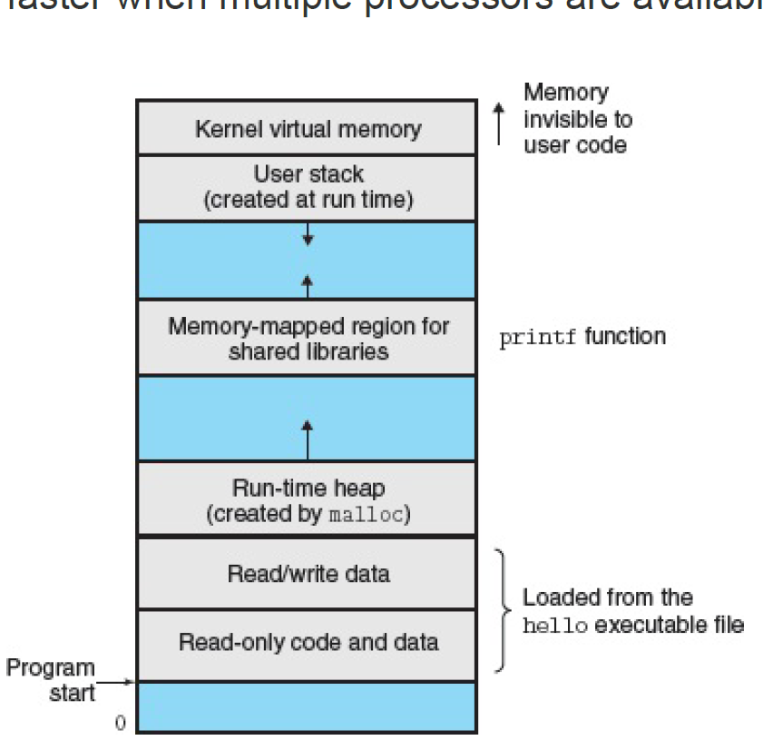

this is a virtual address space in a process. the kernel is in the top space. the virtual address space will be sent to main memory(?) and be executed by CPU. 

###### ?will it be sent to main memory or CP directly?

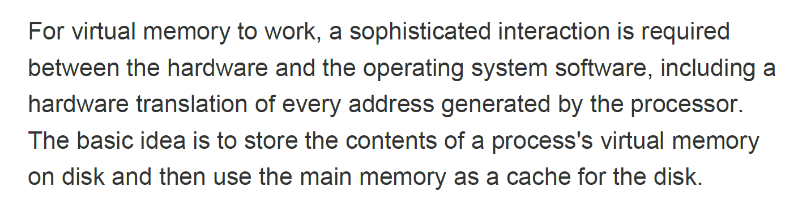

#### 1.7.2 Threads

###### ?why the data need to be share between multiple threads or multiple processes

some application may have more than one process, and it is necessary to share data between them.

#### 1.7.3 Virtual Memory

##### stack

###### <u>?if i don't write return in void function,will the stack of this function contract</u>

i think i should to read c++ primer plus. there is no such solution on the internet

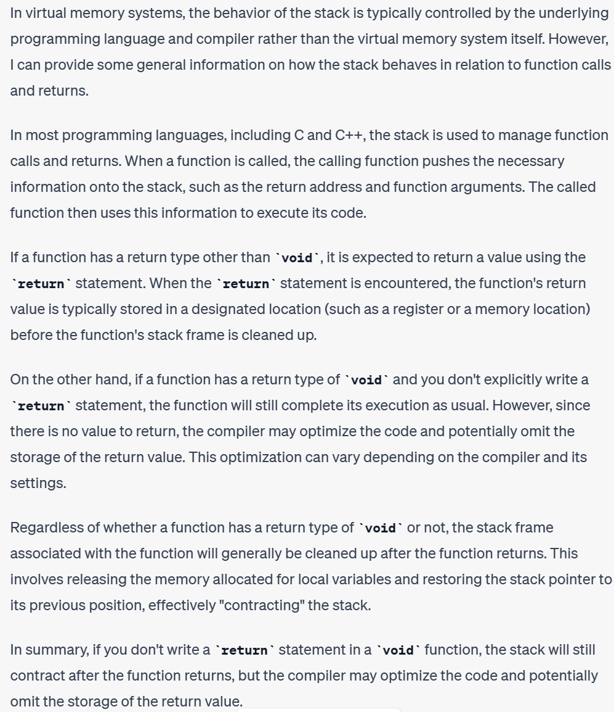

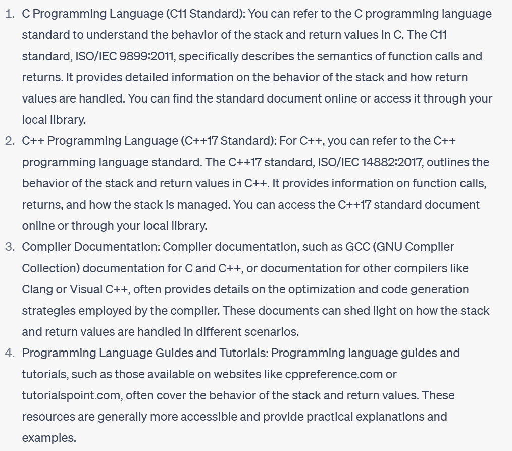

#### 1.7.4 Files

###### ? the whole duration 

origin program->prepocessing(add)->compilation(machine language)->assembly(binary)->linking(merge)

->executable file->run->a process ->load address from executable file -> (allocate memory for)run-time 

heap-> memory-mapped region for shared libraries ->(allocate memory for) stack  ->kernel virtual memory

-> a series of virtual address ->real address ->disk ->main memory ->CPU ->display

### 1.8 Systems Communicate with Other Systems Using Networks

###### ?previous duration

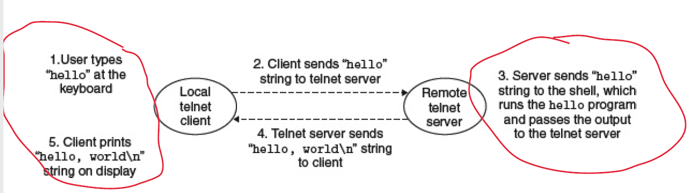

### 1.9 Important Themes

#### 1.9.1 Amdahl's Law

###### Practice Problem 1.1

A:1.25

B:300km/hr

###### Practice Problem 1.2

2.67

#### 1.9.2 Concurrency and Parallelism

#### 1.9.3 The Importance of Abstractions in Computer Systems

### 1.10 Summary

###### ?how to optimize the performance of C programs by understanding and exploiting the memory hierarchy

###### ?what the meaning of Processes are abstractions for the processor, main memory, and I/O devices.

  Processes are created when a program starts running and are destroyed when it finishes running. The meaning of processes as abstractions for these devices refers to how they are managed and scheduled by an operating system

# Part I Program Structure and Execution

## Chapter 2 Representing and Manipulating Information

### 2.1 Information Storage 

### 2.2 Integer Representations 

### 2.3 Integer Arithmetic 

### 2.4 Floating Point 

### 2.5 Summary 

### Bibliographic Notes 

Homework Problems 

## Chapter 3 Machine-Level Representation of Programs

## Chapter 4 Processor Architecture

## Chapter 5 Optimizing Program Performance

## Chapter 6 The Memory Hierarchy

# Part II Running Programs on a System

## Chapter 7 Linking

## Chapter 8 Exceptional Control Flow

## Chapter 9 Virtual Memory

# Part III Interaction and Communication between Programs
## Chapter 10 System-Level I/O

## Chapter 11 Network Programming

## Chapter 12 Concurrent Programming