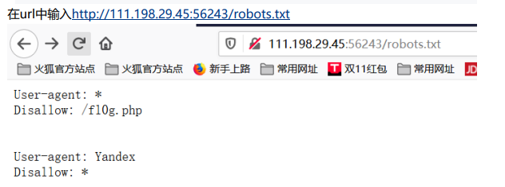
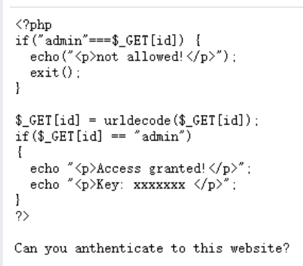
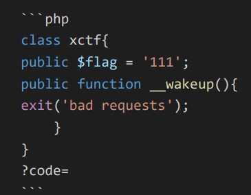
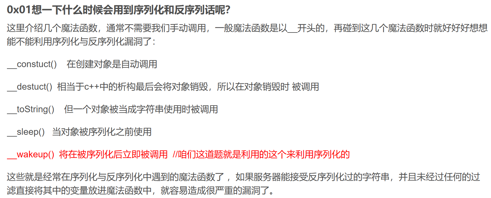
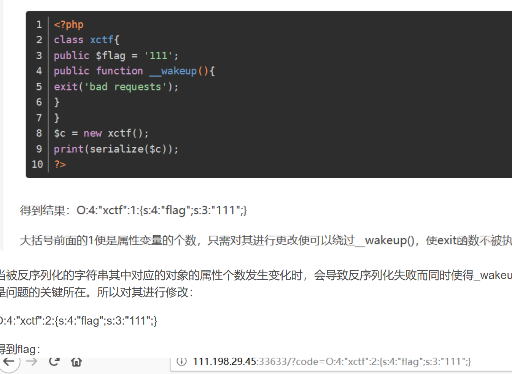

# 2023

## 5/6

### Training-WWW-Robots

  网站的根目录下有个robots.txt，可查看哪些爬虫被允许访问哪些内容

 [robots.txt - Wikipedia](https://en.wikipedia.org/wiki/Robots.txt) 

  到这里以后，我先访问了f10g.php，得到一个cyberpeace，我以为这是被加密了，必须要用Yandex进行访问，于是开始抓包改包。改包发现自己不会改数据包里的user agent，于是用命令行的curl -A ‘agent’ [url]，得到了一样的结果。没办法，看writeup，发现这就是flag……好吧，结束。

### PHP2

就给了一句 Can you anthenticate to this website？，啥也没有。

开始找php的目录，死活找不到，好像有工具可以扫。

先是用了index.php，啥也没有，看了writeup才知道有个index.phps可以在网页看源代码，于是得到代码如下

不懂php，只看自己认识的，然后大概知道好像是要解码

查了之后发现是在给网站赋值id

格式：/?id=xxxxxx。一次加密会被浏览器自动解密为admin，not allowed，于是加密两次

### unserialize3

给了一段php的代码，只知道应该是要给code赋一个值，然后就没头绪了。

查了后知道是反序列。

序列化通俗来讲就是将对象转化为可以传输的字符串；

反序列化就是把那串可以传输的字符串再变回对象。 

***\*__wakeup()执行漏洞：一个字符串或对象被序列化后，如果其属性被修改，则不会执行__wakeup()函数，这也是一个绕过点。\**** 

感觉这种题要系统地学PHP才知道……