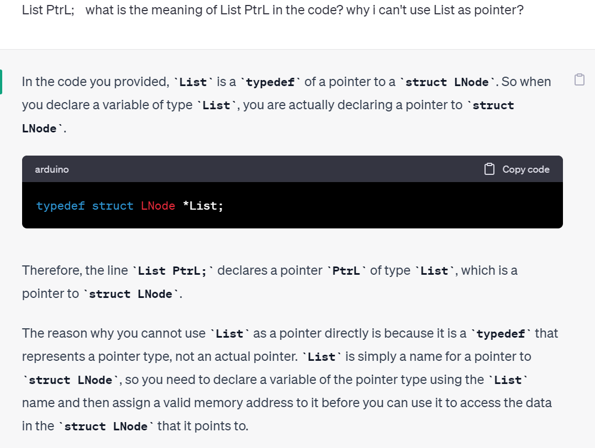
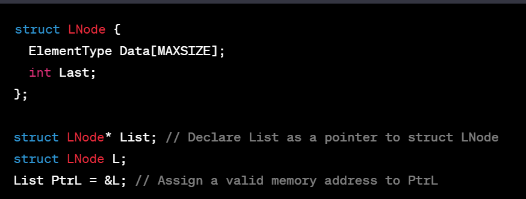
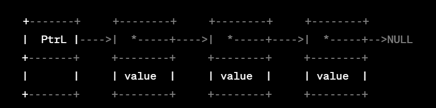
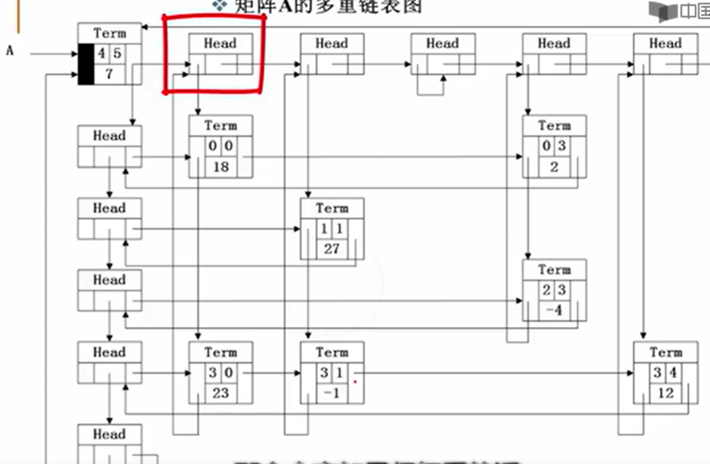
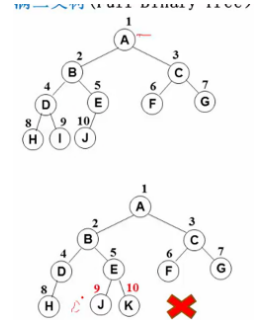
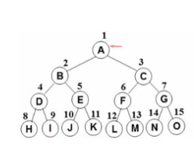
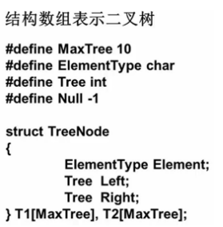
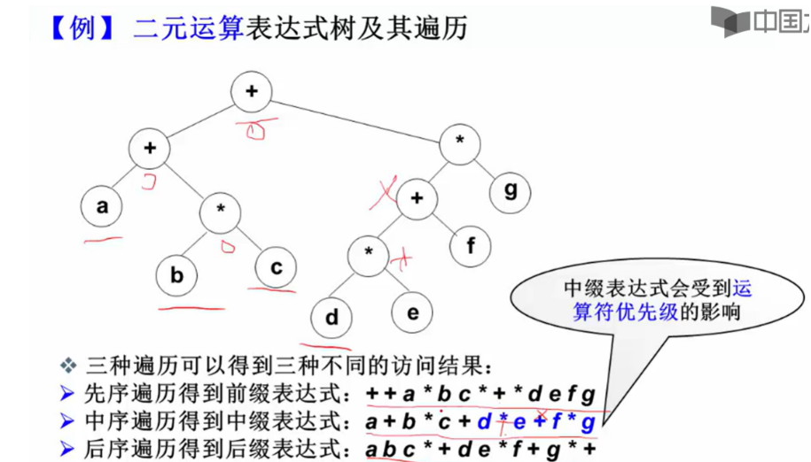

# 数据结构

## 线性结构

### 线性表

抽象数据类型描述：

类型名称

数据对象集

操作集：初始化，根据位序返回元素，查找第一次出现的位置，插入，删除，返回长度

#### 顺序=>数组 

```
typedef struct LNode *List;//List is a type
struct LNode{
	ElementType Data[MAXSIZE];
	int Last;
};//为什么要用struct=>我想让它最终呈现一个封装的形式，能够通过一个接口去访问所有我想要的东西，而不是还需要我自己去求它的长度
struct LNode L;
List PtrL;
//访问下标为i的元素：L.Data[i]||PtrL->Data[i]
//表的长度为PtrL->Last+1||L.Last+1(加不加一看最初Last值)
```





##### 初始化

```
List MakeEmpty()
{
	List PtrL;
	PtrL=(List)malloc(sizeof(struct LNode));
	PtrL->Last=-1;
	return PtrL;
}
```

##### 查找

```
int Find(ElementType X, List PtrL)
{
	int i=0;
	while(i<=PtrL->Last&&PtrL->Data[i]!=X) i++;
	if(i>PtrL->Last) return -1;//didn't find
	else return i;
}
```

##### 插入

```
void Insert(ElementType X,int i,List PtrL){
	if(PtrL->Last==MAXSIZE-1){
		return;//表满
	}
	if(i<1||i>PtrL->Last+2){//要插在表中
		return;//invalid
	}
	for(int j=PtrL->Last;j>=i-1;j--){//for(int j=Last;是不对的！！
		PtrL->Data[j+1]=PtrL->Data[j];
	}
	PtrL->Last++;//移动完后Last值也改变
	PtrL->Data[i-1]=X;
    return；
}
```

##### 删除

```
void Delete(int i,List PtrL){
	if(i<1||i>List->Last+1) return;//invalid（Last从0开始算）
//	if(List->Last==0) return; i<1就是空表
	for(int j=i-1;j<Last;j++){
		List->Data[j]=List->Data[j+1];
	}
	List->Last--;
	return;
}
```


#### 链式=>链表



```
typedef struct LNode *List;
struct LNode{
	ElementType Data;
	List Next;
};
struct Lnode L;
List PtrL;
```

##### 求表长

```
int Length(List PtrL){
    List p=PtrL->Next; //不要改头结点位置
	int cnt=0;
	while(p){
		cnt++;
		p=p->Next;
	}
	return cnt;
}
```

##### 查找

按序号查找

```
List FindKth(int K,List PtrL)
{
	List p=PtrL->Next;
	int i=1;
	while(p!=NULL&&i<K){
		p=p->Next;
		i++;
	}
	if(i==K)return p;
	else return NULL;
}
```

按值查找

```
List Find(ElementType X,List PtrL)
{
	List p=PtrL->Next;
	while(p!=NULL&&p->Data!=X)
	p=p->Next;
	return p;//更简洁
//	while(p!=NULL){
//		if(p->Data==X) return p;
//		else p=p->Next;
//	}
//	return p;
}
```

##### 插入

```
List Insert(ElementType X,int i,List PtrL)
{
	List p,s;
	if(i==1){
		s=(List)malloc(sizeof(struct LNode));
		s->Data=X;
		s->Next=PtrL;
		return s;//不是dummy node！这里的s已经是第一个结点
	}
	p=FindKth(i-1,PtrL);
	if(p==NULL)return NULL;//element wrong
	else{
		s=(List)malloc(sizeof(struct LNode));
		s->Data=X;
		s->Next=p->Next;
		p->Next=s;
		return PtrL;//返回头结点（仍为dummy node）ps:已经是新链表了）
	}
}
```

##### 删除

```
List Delete(int i,List PtrL){
	  List p=FindKth(i-1,PtrL);
	  if(p==NULL) return NULL;
    List s=FindKth(i,PtrL);
	  if(s==NULL) return NULL;
    p->Next=s->Next;
    free(s);
    return PtrL;
    List p,s;
    if(PtrL==NULL) return NULL;
    if(i==1){
    	s=PtrL->Next;
        PtrL->Next=s->Next;
    	free(s);
    	return PtrL;
    }
    p=FindKth(i-1,PtrL);
    if(p==NULL) return NULL;
    else if(p->Next==NULL) return NULL;
    else{
    	s=p->Next;
    	p->NEXT=s->Next;
    	free(s);
    	return PtrL;
    }
}
```

### 广义表，多重链表

转化为线性表

线性表：n个元素都是基本的单元素

广义表：元素可以是另一个广义表


多重链表：链表中的结点可能隶属于多个链，指针域会有多个（但包含两个指针域的链表不一定是多重链表，比如双向链表不是多重链表）

树，图都可以采用多重链表的方式实现存储

##### 矩阵

二维数组表示缺陷：数组大小需事先确定，对于稀疏矩阵会造成存储空间浪费。

十字链表：行，列，值



head既作为行的头结点也作为列的头结点

### 堆栈

### 队列

## 树

### 二叉树

完全二叉树




完美二叉树



树叶数=度为2的非叶结点数+1

#### 存储

数组=>空间浪费

链表=>左儿子右兄弟

结构数组=>静态链表




找根：没有被指向

#### 遍历=>二维变一维

前序：结左右(第一次碰到结点时输出)

```c++
void search(BinTree BT){
    BinTree T=BT;
    Stack S=CreatStack(MaxSize);
    while(T||!IsEmpty(S)){
        while(T){
            push(S,T); 
            printf("%d",T->Data);
        	T=T->left;  
        }
    	if(s!=NULL){
        	T=pop(S,T);
        	T=T->right;
    	}
    }
}
```

中序：左结右（第二次碰到结点时输出）

```c++
void search(BinTree BT){
    BinTree T=BT;
    Stack S=CreatStack(MaxSize);
    while(T||!IsEmpty(S)){
        while(T){
            push(S,T);   
        	T=T->left;  
        }
    	if(s!=NULL){
        	T=pop(S,T);
        	printf("%d",T->Data);
        	T=T->right;
    	}
    }
}
```

后序：左右结（第三次碰到结点）

```c++
//strcut TreeNode {
//  ElemType data;
//  TreeNode *left, *right;
//  TreeNode() {
//      left = right = NULL;
//  }
//}
void PostOrder(TreeNode BT) {
    TreeNode T= BT, r = NULL;
    Stack S=CreatStack(MaxSize);
    while (T || !S.empty()) {
        if (T) {//走到最左边
            push(S,T);
            T = T->left;
        }
        else {
            T = pop(S,T);
            if (T->right && T->right != r)//右子树存在，未被访问
                T = T->right;
            else {
                pop(S,T);
                printf("%d",T->Data);
                r = T;//记录最近访问过的节点
                T = NULL;
                //节点访问完后，重置p指针,必须重置，因为左右都访问完了，需pop
            }
        }//else
    }//while
}
```

这三种都可以使用堆栈

层序遍历=>队列保存

```c++
void LevelOrderTraversal(BinTree Bt){
    Queue Q; BinTree T;
    if(!BT) return;
    Q=CreatQueue(MaxSize);
    AddQ(Q,BT);
    while(!IsEmptyQ(Q)){
        T=DeleteQ(Q);
        printf("%d\n",T->Data);
        if(T->Left)AddQ(Q,T->Left);
        if(T->Right)AddQ(Q,T->Right);
    }
}
```

#### 应用

##### 输出叶子节点

判断无左右儿子

```C
void PostOrderPrintLeaves(BinTree BT){
    if(BT){
        if(!BT->Left&&!BT->Right) printf("%d",BT->Data);
        PostOrderPrintLeaves(BT->Left);
        PostOrderPrintLeaves(BT->Right);
    }
}
```


##### 求二叉树高度

左右子树高度+1

```c++
int PostOrderGetHeight(BinTree BT)
{
    int HL,HR,MaxH;
    if(BT){
        HL=postOrderGetHeight(BT->Left);
        HR=postOrderGetHeight(BT->Right);
        MaxH=(HL>HR)?HL:HR;   
        return (MaxH+1);
    }
    else return 0;
}
```

##### 二元运算表达式树及其遍历



可以通过加括号的方式准确实现中缀表达式

#####  两种遍历序列确定二叉树

必须有中序遍历

##### 判断同构

左右孩子交换可变成一样


### 二叉搜索树

### 平衡二叉树

### 堆

### 哈夫曼树和哈夫曼编码

### 集合


