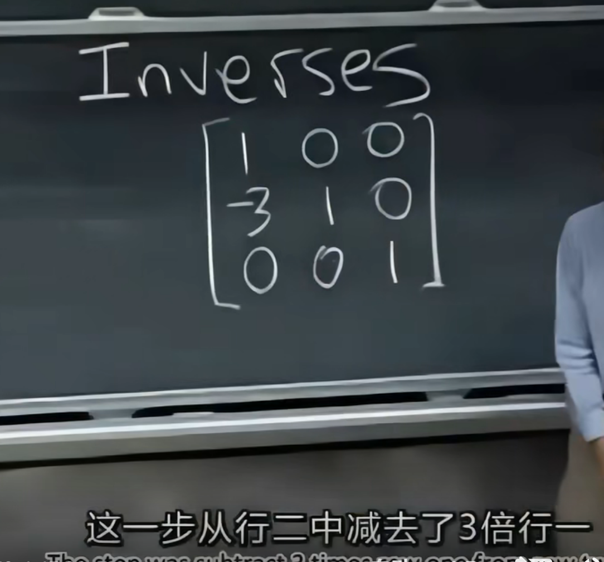

# 1.01方程组的几何解释

row pictures

column pictures

任意b满足Ax=b => column picture 中向量不共线（面） 

计算

# 2.02矩阵消元

主元为0交换行（暂时有效 ）

第一个矩阵看为对第二个矩阵每一行的处理

1 0 0    1 2 1 =>1 2 1 不变，处理第一个式子

-3 1 0   3 8 1 =>0 2 -2 对第一个式子乘-3，在第二个式子中减去三倍行一，实现消元

0 0 1   0 4 1 =>0 4 1 处理第三个式子

### 初等矩阵

E21

E32

#### 逆变换

U->A

### 置换矩阵

行

列 

